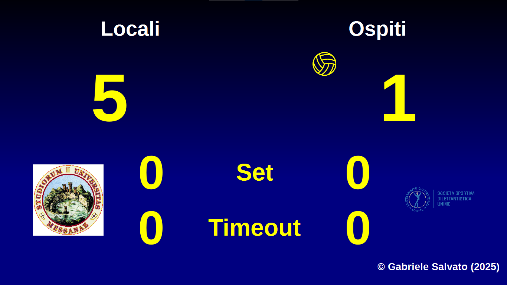
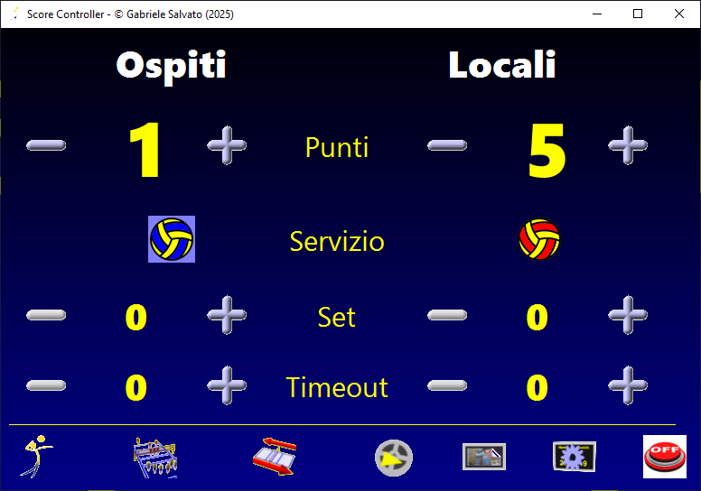
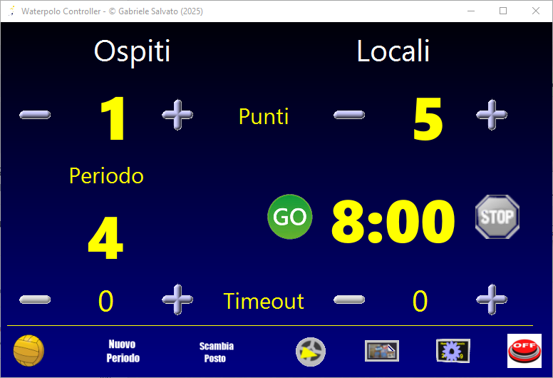
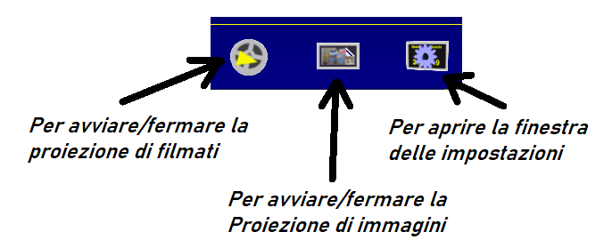
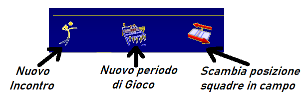
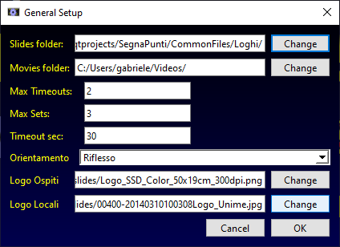
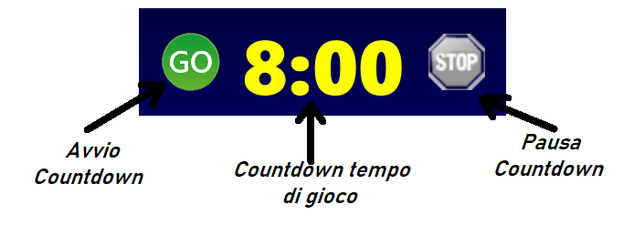

# Segnapunti

Un insieme di programmi per gestire tabelloni segnapunti di varie discipline sportive
(Attualmente ***Volley*** e ***Pallanuoto***)

Il programma prevede l'uso di un **PC** con la possibilità di collegare un secondo schermo che deve essere configurato come ***"estensione"*** dello schermo principale.

Il ***"tabellone"*** verrà visualizzato sul secondo schermo mentre sullo schermo principale verrà visualizzato il ***"controller"***-

Per il *Volley* il ***controller*** è il seguente:

Per la *Pallanuoto* il ***controller*** è:

Attraverso il ***controller*** è possibile modificare i valori mostrati sul ***tabellone*** come, ad esempio, i nomi delle squadre e i loghi ad esse corrispondenti. Le modifiche sono immediatamente mostrate sul ***tabellone***.

Inoltre sullo schermo del ***tabellone*** è possibile mostrare sequenze di immagini e/o brevi filmati.

Nella parte inferiore del ***controller*** sono presenti tre *pulsanti*, comuni a tutte le discipline sportive, che permettono di controllare l'avvio o l'arresto delle proiezioni di filmati o delle sequenze di immagini.

I tre pulsanti a sinistra (le cui icone differiscono per i vari sport supportati) servono ad iniziare un nuovo incontro, un nuovo periodo di gioco e a variare la posizione delle squadre nel campo di gioco. 

## Volley:

Il pulsante che permette di variare le **impostazioni** del programma fa comparire una finestra dalla quale è possibile variare alcuni parametri.

- *Slides folder* permette di selezionare la cartella contenente le immagini
- *Movies folder* per selezionare la cartella con i filmati
- *Max Timeouts* per fissare il numer di timeout che ogni squadra può invocare in ogni set
- *Max Sets* fissa il numero massimo di set per ciascuna partita
- *Timeiut sec* fissa la durata in secondi di cascun timeout
- *Orientamento* permette di variare l'orientamento del *tabellone segnapunti*
- *Logo Ospiti* permette di selezionare il file contenente l'immagine del logo della squadra *Ospiti*
- *Logo Locali* permette di selezionare il file contenente l'immagine del logo della squadra *Locali*

## Pallanuoto:

Nel ***controller*** è presente una zona per la gestione del ***countdown*** del tempo di gioco:

Per il controllo dello ***Start/Stop*** è possibile utilizzare anche la ***barra spaziatrice***: una pressione fa partire il *countdown* una successiva pressione lo mette in pausa.
